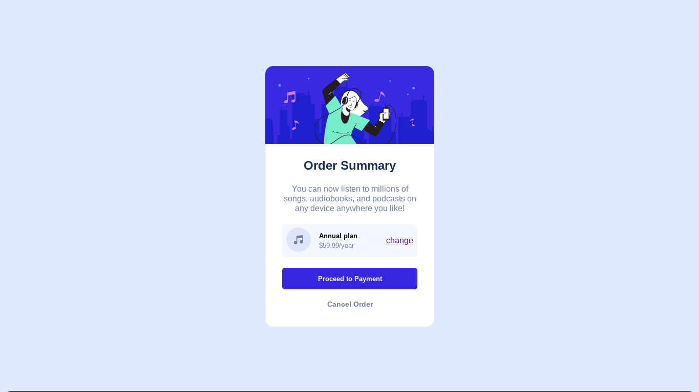

# Frontend Mentor - Order summary card solution

This is a solution to the [Order summary card challenge on Frontend Mentor](https://www.frontendmentor.io/challenges/order-summary-component-QlPmajDUj). Frontend Mentor challenges help you improve your coding skills by building realistic projects.

## Table of contents

- [Overview](#overview)
  - [The challenge](#the-challenge)
  - [Screenshot](#screenshot)
  - [Links](#links)
- [My process](#my-process)
  - [Built with](#built-with)
  - [What I learned](#what-i-learned)
  - [Continued development](#continued-development)
- [Author](#author)

## Overview

### The challenge

Users should be able to:

- See hover states for interactive elements

### Screenshot



### Links

- Solution URL: [https://github.com/dagm-G/Order-summary-component]
- Live Site URL: [https://dagm-g.github.io/Order-summary-component/]

## My process

### Built with

- Semantic HTML5 markup
- CSS custom properties
- Flexbox

### What I learned

The challenge was a good match for my current skill level.

Getting the curvature of the image to match with the Card's upper part
was a bit hard to implement because i didn't know you could set a value to individual edges using the border-radius property like in the code below.

```css
#card-img {
  border-top-left-radius: inherit;
  border-top-right-radius: inherit;
}
```

so, i was happy when i solved that.

Other than that i've tried my best to make the content responsive for every type of device but i still can't figure out the best way to do it , i hope i'll get some suggestions on it from the community.

### Continued development

I'd like to try other ways to center cards like this using other ways. In addition to this i'd like to dig deeper on responsive design and the mobile first approach inorder to make my sites have an attractive look on any device.

## Author

- Website - [https://dagm-g.github.io/Order-summary-component/]
- Frontend Mentor - [@dagm-G](https://www.frontendmentor.io/profile/dagm-G)
